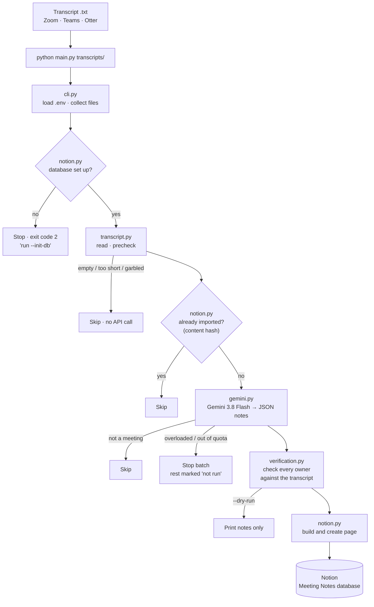
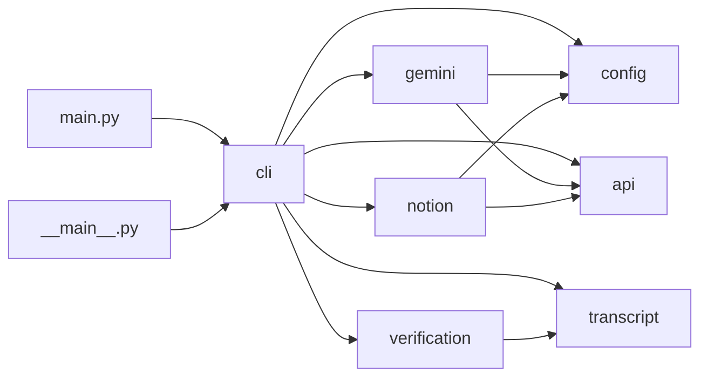

# Project structure

A file-by-file guide to this repository: what each file is for, what's inside it, and how the pieces fit together. The source code deliberately has no comments or docstrings; this document is where the explanations live.

- For setup and usage, see [README.md](README.md).
- For the design reasoning, test results and assignment write-up, see [DOCUMENTATION.md](DOCUMENTATION.md).

---

## 1. The project in one paragraph

`meeting-notes` turns call transcripts that a team already has (Zoom, Teams or Otter exports) into structured pages in a Notion database. **Gemini 3.8 Flash** extracts the title, date, attendees, summary, decisions and action items. The code then **checks every action item's owner against the transcript's actual words**, and marks anything it can't confirm as **⚠️ Please verify**. Finally, it creates a formatted page through **Notion's REST API**. It runs as one command (`python main.py transcripts/`), uses only the Python standard library, and has no server.

## 2. How a transcript flows through the code



The same flow as text:

1. **`cli.py`** reads the command-line arguments, loads `.env` through `config.py`, turns folders into a list of `.txt` files, and asks `notion.py` to confirm the database has every required column. This happens once, before any tokens are spent.
2. For each file, **`transcript.py`** reads it in whatever encoding it uses and rejects it locally if it's empty, too short or garbled.
3. **`notion.py`** checks whether the transcript was already imported, by content hash (or by filename, for pages created before hashes existed).
4. **`gemini.py`** sends the transcript to Gemini 3.8 Flash with a fixed JSON schema, retries twice if Gemini is busy, and normalizes the answer.
5. **`verification.py`** checks every action item's owner against the transcript and records the reasons for any "please verify" flag. It also blanks dates that aren't real calendar dates.
6. **`notion.py`** builds the page (callout, summary, attendees, decisions, action-items table, assumptions, footer) and creates it.
7. **`cli.py`** prints a summary and exits with 0 (all good), 1 (a file failed) or 2 (setup problem).

## 3. Folder layout

```
meeting-notes/
├── .github/
│   └── workflows/
│       └── tests.yml                 CI: runs the test suite on Ubuntu and Windows
├── src/
│   └── meeting_notes/
│       ├── __init__.py               Package version
│       ├── __main__.py               Lets `python -m meeting_notes` work
│       ├── api.py                    HTTP helper and ApiError
│       ├── cli.py                    Arguments, batch runner, output, exit codes
│       ├── config.py                 .env loading and settings validation
│       ├── gemini.py                 Prompt, schema, retries, parsing, cost
│       ├── notion.py                 Database checks and setup, duplicates, page building
│       ├── transcript.py             Reading, prechecks, speaker splitting, content hash
│       └── verification.py           Owner verification and date handling
├── tests/
│   ├── __init__.py                   Puts src/ on the path for the tests
│   ├── fakes.py                      Fake HTTP, sample notes and settings
│   ├── test_cli.py                   Batch behaviour, file collection, exit codes
│   ├── test_config.py                .env loading and settings
│   ├── test_gemini.py                Retries, parsing, normalization, cost
│   ├── test_notion.py                Page layout, limits, database checks, duplicates
│   ├── test_transcript.py            Prechecks, speakers, hashing, encodings
│   └── test_verification.py          Owner checks and date handling
├── transcripts/
│   ├── README.md                     What goes in this folder
│   ├── sample-client-kickoff-brightpath.txt
│   └── sample-sales-discovery-ridgeline.txt
├── .editorconfig                     Editor formatting rules
├── .env                              Your real keys (never committed)
├── .env.example                      Template for .env
├── .gitattributes                    Line-ending rules
├── .gitignore                        Files git must never track
├── CHANGELOG.md                      Release notes
├── DOCUMENTATION.md                  Assignment write-up and build log
├── PROJECT_STRUCTURE.md              This file
├── README.md                         Setup and usage
├── main.py                           Entry point: puts src/ on the path and runs the CLI
└── pyproject.toml                    Package metadata and the `meeting-notes` command
```

Folders named `__pycache__/` appear after running the code. Python creates them automatically; they're git-ignored.

## 4. How the modules depend on each other



`cli.py` is the only module that knows about all the others. `api.py`, `config.py` and `transcript.py` depend on nothing inside the project, so they can be understood and tested on their own.

---

## 5. Files, one by one

### Entry point

#### `main.py`
The command you run: `python main.py transcripts/`. It adds `src/` to Python's import path, so nothing has to be installed, then calls `meeting_notes.cli.main()` and exits with its return code. After `pip install -e .`, the `meeting-notes` command does the same thing.

### Package: `src/meeting_notes/`

#### `__init__.py`
Holds `__version__ = "1.0.0"`, shown by `--version`.

#### `__main__.py`
Runs `cli.main()`, so the package also works as `python -m meeting_notes` once `src/` is on the path or the package is installed.

#### `api.py` — talking to web APIs
| Name | What it does |
|---|---|
| `DEFAULT_TIMEOUT_S` | 180 seconds. A long transcript can take Gemini a while. |
| `ApiError` | The one error type for failed API calls. `status` is the HTTP code (0 for network failures or unusable responses), `message` is the readable reason, `service` is `"Gemini"` or `"Notion"`. Printing it gives `"Gemini: <message>"`. |
| `request_json(method, url, headers, body, timeout)` | Sends a JSON request with `urllib` and returns the decoded JSON. Turns HTTP errors, network errors, timeouts and invalid JSON into `ApiError`. |
| `_error_message(error)` | Pulls the human-readable message out of an error response. Gemini nests it under `error.message`; Notion puts it in `message`. |

#### `config.py` — settings
| Name | What it does |
|---|---|
| `DEFAULT_MODEL` | `"gemini-3.8-flash"` |
| `REPO_ROOT` | The project folder, found from this file's location. |
| `ConfigError` | Raised for setup problems. The message always says how to fix it. |
| `load_dotenv(start)` | Loads `KEY=VALUE` lines from `.env` in the current folder, or else the project root. Values already set in the environment win, so a scheduler can override the file. Supports comments, blank lines, `export KEY=…` and quoted values. |
| `_parse_dotenv(text)` | Yields key/value pairs from the file's text. |
| `_get(name)` | Reads an environment variable, treating unfilled placeholders (anything starting with `your-`) as empty. |
| `_price(name)` | Reads a price variable as a number, rejecting text and negative values. |
| `Settings` | A frozen dataclass: `gemini_api_key`, `gemini_model`, `notion_token`, `notion_database_id`, `input_usd_per_m`, `output_usd_per_m`. |
| `Settings.from_env(need_gemini, need_notion)` | Builds settings from the environment and raises one `ConfigError` naming every missing value. Removes dashes from the database ID. A `--dry-run` doesn't require the Notion values. |

#### `transcript.py` — reading and preparing transcripts
| Name | What it does |
|---|---|
| `MIN_WORDS` | 40. Anything shorter can't be a meeting worth notes. |
| `MIN_LETTER_RATIO` | 0.6. Below this, the file is mostly symbols or numbers. |
| `SPEAKER_INLINE` | Matches Zoom/Teams lines such as `[00:01:02] Priya Nair: text`. |
| `SPEAKER_HEADER` | Matches Otter speaker lines such as `Priya Nair  0:12`, where the text follows on the next lines. |
| `read_transcript(path)` | Reads the file as UTF-16 (if it has a UTF-16 byte-order mark), otherwise UTF-8 (with or without BOM), falling back to Windows-1252. |
| `precheck(text)` | Returns why a transcript is unusable (`"file is empty"`, `"mostly non-letter characters, looks garbled"`, `"only N words…"`) or `None`. Runs locally, so bad files never cost an API call. |
| `_is_letter(ch)` | Counts letters *and* combining marks, so scripts like Devanagari aren't mistaken for garbage. |
| `content_hash(text)` | SHA-256 of the transcript, ignoring line-ending style and trailing spaces. Used for duplicate detection. |
| `normalize(text)` | Lowercases, turns punctuation into spaces and collapses whitespace. Quotes and transcripts are compared in this form. |
| `utterances(text)` | Splits a transcript into normalized lines, each starting with its speaker's name. Handles both Zoom-style and Otter-style formats. |

#### `verification.py` — the misattribution safeguard
| Name | What it does |
|---|---|
| `MIN_QUOTE_WORDS` | 3. A shorter quote ("Perfect.", "Will do.") appears in too many places to prove who said it. |
| `verify_action_items(notes, text)` | Adds a `verify` list to every action item: the reasons it needs a human check, or an empty list if none. |
| `_reasons(item, whole, said)` | Applies the rules below, in order. |
| `fix_date(notes)` | Keeps the date only if it's a real `YYYY-MM-DD` date. Otherwise it blanks the date and adds an assumption saying why ("No meeting date was stated…" or "Date "next Tuesday" wasn't a clear calendar date…"). |

The rules `_reasons` applies. An item gets a reason for each one that's true:

| Rule | Reason shown |
|---|---|
| The owner is empty, has no letters, or the model marked it `unassigned` | `no owner named in the transcript` |
| The model marked the owner `implied` | `owner inferred, not stated (best guess: <owner>)` |
| The quoted evidence isn't in the transcript | `supporting quote not found in the transcript` |
| The quote is shorter than 3 words | `supporting quote too short to verify` |
| The quote is found, but the owner's first name isn't in any line containing it, as speaker or as someone addressed | `the quote isn't from or addressed to <owner>` |
| The model marked it a hedged promise | `soft commitment, may not happen` |

If a quote spans several lines, it can't be tied to one speaker, so only the "found in the transcript" rule applies to it.

#### `gemini.py` — extraction with Gemini 3.8 Flash
| Name | What it does |
|---|---|
| `API_BASE` | The Gemini `generateContent` base URL. |
| `RETRY_WAITS_S` | `(20, 40)`: two retries, spaced out, because failed calls can still count against quota. |
| `RETRY_STATUSES` | `429`, `500`, `503`: the errors worth retrying. |
| `OWNER_STATUSES` | `explicit`, `implied`, `unassigned`. |
| `PROMPT` | The system instructions: use only what's in the transcript; reject non-meetings; date only if stated; decisions only if actually agreed; follow hand-offs to the person who ends up responsible; how to label owners; evidence copied verbatim from one speaker's line (at least 5 words); flag hedged promises; list assumptions. |
| `SCHEMA` | The JSON shape Gemini must return: `is_meeting_transcript`, `rejection_reason`, `title`, `date`, `attendees[]`, `summary`, `decisions[]`, `action_items[]` and `assumptions[]`. |
| `GeminiClient(settings, http, sleep, notify)` | The client. `http`, `sleep` and `notify` can be swapped for fakes in tests. |
| `GeminiClient.model` | The model name from settings. |
| `GeminiClient.extract(text, source)` | Sends the transcript with the prompt, schema and `thinkingLevel: low`, and returns `(notes, usage)`. |
| `GeminiClient._post(body)` | Handles failures. If the model rejects the thinking setting, it retries without it. A `404` becomes "check GEMINI_MODEL". A `429` mentioning quota stops immediately, since waiting won't help. `429`/`500`/`503` otherwise retry after 20 s, then 40 s, printing "Gemini busy…". Anything else raises `ApiError` tagged `"Gemini"`. |
| `parse_response(response)` | Rejects blocked prompts, answers that didn't finish (`finishReason` other than `STOP`), invalid JSON and non-object JSON. It ignores "thought" parts, then normalizes the result. |
| `normalize_notes(data)` | Forces the answer into the exact shape the rest of the code expects. Every list is newly created, malformed entries are dropped, missing text becomes `""`, the title defaults to `"Untitled meeting"`, and an unknown `owner_status` becomes `unassigned`, so it gets flagged rather than trusted. |
| `cost_usd(usage, settings)` | Cost of one call, if prices are set: input tokens × input price + (output + thinking tokens) × output price, per million. Returns `None` when prices aren't configured. |
| `_text`, `_list`, `_strings` | Small helpers that safely read strings and lists from model output. |

#### `notion.py` — writing to Notion
| Name | What it does |
|---|---|
| `API_BASE`, `API_VERSION` | Notion's API address and the version header (`2022-06-28`). |
| `TEXT_LIMIT` | 2,000: Notion's maximum characters per rich-text item. |
| `MAX_TEXT_CHUNKS` | 100: Notion's maximum rich-text items in one property or block. |
| `LIST_LIMIT` | 25: the most bullets or table rows per section, which keeps the largest possible page under Notion's 100-block request limit. |
| `REQUIRED_COLUMNS` | `Date` (date), `Attendees` (text), `Needs review` (checkbox), `Source` (text), `Content hash` (text), plus the database's own title column. |
| `NotionClient(settings, http)` | The client. `http` can be swapped for a fake in tests. |
| `NotionClient._call(method, path, body)` | Sends a request with the token and version header. A `401` becomes "the access token was rejected…"; a `404` becomes "the database isn't visible…, add the connection". Every error is tagged `"Notion"`. |
| `NotionClient.columns()` | Returns the database's column names and types. |
| `NotionClient.check_database()` | Confirms every required column exists with the right type, and returns the title column's name. Otherwise it raises `ConfigError`, naming the problems and pointing to `--init-db`. |
| `NotionClient.init_database()` | Adds any missing columns in one update and returns their names. It refuses to run if an existing column has the wrong type, so it never changes existing columns. |
| `NotionClient.find_existing(source, digest)` | Returns the URL of an already-imported page: first by matching `Content hash`, then (for older pages with an empty hash) by matching `Source`. Returns `None` if there's no match. |
| `NotionClient._first_match(filter)` | Runs a database query and returns the first result's URL. |
| `NotionClient.create_page(...)` | Creates the page. Properties: title, `Attendees`, `Needs review` (ticked if any item has reasons), `Source`, `Content hash`, and `Date` only when there is one. The body comes from `page_blocks`. |
| `_title_column(columns)` | Finds the database's title column, whatever it's called. |
| `rich_text(text)` | Converts text into Notion rich text, split into 2,000-character chunks. |
| `block(kind, text, **extra)` | Builds a simple Notion block: paragraph, heading, bullet or callout. |
| `status_text(item)` | `"✅ Owner named"`, or `"⚠️ Please verify: reason; reason"`. |
| `_bullets(items, empty)` | A bulleted list capped at `LIST_LIMIT` with a "…and N more" note, or a paragraph saying there's nothing. |
| `page_blocks(notes, source, usage, model, today)` | The page body, in order: a yellow callout ("N of M action items need a human check…") or a green one (all owners confirmed); Summary; Attendees; Decisions; an action-items table (Task · Owner · Due · Status · From the transcript); Assumptions made (if any); a divider; and a footer naming the file, model, date and token counts. |

#### `cli.py` — the command line and batch runner
| Name | What it does |
|---|---|
| `EXIT_OK`, `EXIT_FAILED`, `EXIT_CONFIG` | Exit codes 0, 1 and 2. |
| `STOP_BATCH_STATUSES` | `429`, `503`: Gemini errors that mean the rest of the batch would fail too. |
| `Result` | One file's outcome: `name`, `status` (`created`, `skipped`, `dry run`, `failed` or `not run`) and `detail`. |
| `collect_files(paths)` | Expands folders into their `.txt` files (sorted), keeps named files, drops duplicates, and raises `ConfigError` for missing paths or when nothing is found. |
| `Runner(gemini, notion, dry_run, force, out)` | Processes a batch. `out` is where output lines go, which lets tests capture them. |
| `Runner.run(files)` | Checks the database once (unless it's a dry run), then processes each file. A failed file doesn't stop the batch, except when Gemini is overloaded or out of quota: then the remaining files are marked `not run`. |
| `Runner._process(path)` | For one file: read, precheck, duplicate check (skipped with `--force` or `--dry-run`), Gemini extraction, "not a meeting" check, date fix, owner verification, print, then create the page unless it's a dry run. |
| `Runner._show(notes, usage)` | Prints the extracted notes, each ✅/⚠️ item with its reasons, the assumptions, the token counts and the cost. |
| `build_parser()` | Defines `paths`, `--dry-run`, `--force`, `--init-db` and `--version`. |
| `main(argv)` | Validates the argument combinations, loads `.env`, runs `--init-db` or the batch, prints setup errors to stderr with exit code 2, prints the final summary and returns the exit code. |
| `_init_db(out)` | Runs `NotionClient.init_database()` and reports which columns were added. |
| `_utf8_console()` | Switches the console output to UTF-8, so Windows terminals can print ✅ and ⚠️. |

### Tests: `tests/`

The whole suite runs offline with `python -m unittest -v`: 81 tests, no network, no keys, no cost. The API clients take fake `http`, `sleep` and output functions, so even retries and outages are tested without calling Gemini or Notion.

#### `tests/__init__.py`
Defines `ROOT` and `TRANSCRIPTS` (paths used by the tests) and adds `src/` to the import path.

#### `tests/fakes.py`
| Name | What it does |
|---|---|
| `SETTINGS` | Fake settings with dummy keys and real prices ($0.75 / $3.75). |
| `FakeHttp` | Replaces `request_json`: returns or raises pre-set responses in order and records every call (method, URL, headers, a copy of the body). |
| `meeting_notes(**overrides)` | Sample notes in the shape `normalize_notes` produces, with one correctly owned action item. |
| `gemini_response(notes, usage, finish)` | A fake Gemini response wrapping those notes. |

#### `tests/test_config.py` — 7 tests
`.env` values load without overriding the shell environment; placeholders count as missing; every missing key is named in one message; a dry run needs only the Gemini key; the model and prices come from the environment; non-numeric prices are rejected; database IDs with dashes are accepted.

#### `tests/test_transcript.py` — 12 tests
Empty, garbled and too-short files are rejected; both sample transcripts pass; Hindi text isn't mistaken for garbage; Zoom and Otter speakers are attached to their lines; content hashes ignore line endings but change with content; UTF-16, UTF-8-with-BOM and Windows-1252 files are read correctly.

#### `tests/test_verification.py` — 13 tests
Using the real sample transcripts: correct owners pass; the person asked first (Sarah) and the person who handed the task off (Daniel) are caught; an invented quote is caught; the Otter format is checked the same way; unassigned, implied and soft items get the right reasons; a too-short quote and an owner with no real name are flagged; valid dates are kept, while missing or vague dates are blanked with an assumption.

#### `tests/test_gemini.py` — 16 tests
Defaults are fresh for every transcript; malformed model output is cleaned up; one request returns notes and usage with the right URL, key header and thinking setting; the model can be changed; an overload retries twice (20 s, 40 s) and then gives up; a retry can succeed; quota errors aren't retried; an unsupported thinking setting is dropped; an unknown model points to `GEMINI_MODEL`; truncated, invalid and blocked answers are errors; "thought" parts are ignored; cost matches the recorded run ($0.005733), bills thinking tokens at the output price, and is hidden without prices.

#### `tests/test_notion.py` — 18 tests
The callout counts flagged items and turns green when all owners are confirmed; the table has a header and one row per item with the right status text; a meeting with no action items says so; a page with 200 of everything stays within Notion's limits; long text is split into 2,000-character chunks; the footer names the file, model, date and tokens; the database check returns the title column, or names missing columns and `--init-db`; setup adds only missing columns, does nothing when complete, and never changes column types; duplicates are found by hash, then filename for older pages, while the same filename with different content isn't a duplicate; token and sharing errors explain the fix; page creation writes the review flag and hash and omits a blank date.

#### `tests/test_cli.py` — 15 tests
One page per transcript; a Gemini overload stops the batch and marks the rest `not run`; a Notion failure doesn't stop the batch; imported transcripts are skipped before calling Gemini; `--force` imports again; non-meetings are skipped without writing; garbled files are skipped without any API call; a dry run works without Notion; "please verify" reasons and costs are printed; folders expand to sorted `.txt` files without duplicates; missing paths, missing keys and missing arguments produce the right exit codes.

### Sample data: `transcripts/`

#### `transcripts/README.md`
Explains that transcripts go here as `.txt` files, and that everything except files named `sample-*` is git-ignored, because real transcripts contain client data.

#### `transcripts/sample-client-kickoff-brightpath.txt`
A fictional 5-minute Zoom-style kickoff between an agency (Priya, Daniel) and a dental group (Sarah, Mark), dated 2026-09-10. It's written with deliberate traps for the owner check:
- **A task redirected to someone else:** Mark asks Sarah for the brand guidelines, Sarah says Mark has them, and Mark takes it.
- **A hand-off:** Daniel passes the sitemap to Aisha, and Priya says she'll ask Aisha.
- **An implied owner:** "We'll get the revised quote over to you… Will do."
- **A hedged promise:** "I'll try… but no promises."
- **An unowned task:** "someone should probably loop in legal."

#### `transcripts/sample-sales-discovery-ridgeline.txt`
A fictional 2-minute Otter-style sales call between Priya and Tom, with **no date stated**. It includes one clear commitment (case studies by Thursday), one vague "we'd need to check with finance", and one unowned "someone will set that up".

### Root configuration and docs

#### `.env` (never committed)
Your real settings. Git ignores it. Only you create and edit it.

#### `.env.example`
The template for `.env`. Copy it to `.env` and fill it in:

| Variable | Where to get it / what it does |
|---|---|
| `GEMINI_API_KEY` | Google AI Studio → **Get API key**. Required. |
| `NOTION_TOKEN` | Notion → **Developer tools → Connections → your connection → Access token** (starts with `ntn_`). Required unless using `--dry-run`. |
| `NOTION_DATABASE_ID` | The 32-character code before `?v=` in the database's URL. Required unless using `--dry-run`. |
| `GEMINI_MODEL` | Optional. Leave blank to use `gemini-3.8-flash`. |
| `GEMINI_INPUT_USD_PER_M` / `GEMINI_OUTPUT_USD_PER_M` | Optional prices per 1M tokens, from Google's Gemini pricing page. Filled in with Gemini 3.8 Flash's paid-tier rates, which apply through 2026-12-31 and double from 2027-01-01. When set, each run prints its cost. |

#### `.gitignore`
Tells git what never to track:
- `.env` and any `.env.*` file, except `.env.example`.
- Everything in `transcripts/` except `README.md` and `sample-*` files.
- Python build output: `__pycache__/`, `*.pyc`, virtual environments (`.venv/`, `venv/`), and packaging output (`build/`, `dist/`, `*.egg-info/`).

#### `.gitattributes`
`* text=auto eol=lf`: every text file is stored and checked out with Unix (LF) line endings, on every operating system.

#### `.editorconfig`
Editor settings: UTF-8, LF line endings, a final newline, no trailing spaces, 4-space indents for Python, 2-space indents for YAML/TOML/JSON, and trailing spaces allowed in Markdown.

#### `pyproject.toml`
Package metadata: the name `meeting-notes`, version `1.0.0`, Python 3.9 or newer, no dependencies. It also defines a `meeting-notes` command (after `pip install -e .`) that runs `meeting_notes.cli:main`, and tells setuptools the code lives in `src/`.

#### `.github/workflows/tests.yml`
GitHub Actions CI. On every push and pull request, it runs `python -m unittest -v` on Ubuntu and Windows with Python 3.9 and 3.13. The tests make no API calls, so the workflow needs no secrets.

#### `README.md`
Setup and usage: requirements, how to create the Notion connection and database, `--init-db`, running the command, options, exit codes, configuration, database columns, a short "how it works", development, security and limitations.

#### `DOCUMENTATION.md`
The assignment write-up: the capability and its caveat, the pain point and the Notion comparison, the what/why/how of the workflow, measured costs, the three-run comparison, edge cases, other pairings considered, 10 interview questions, research sources and the build log.

#### `CHANGELOG.md`
Release notes in "Keep a Changelog" format: what was added, changed and fixed in each version.

---

## 6. Data passed between modules

### Notes (produced by `gemini.normalize_notes`, used everywhere after)

| Field | Type | Meaning |
|---|---|---|
| `is_meeting_transcript` | bool | `false` means skip the file |
| `rejection_reason` | text | Why it isn't a meeting |
| `title` | text | Meeting title (defaults to "Untitled meeting") |
| `date` | text | `YYYY-MM-DD`, or empty |
| `attendees` | list of `{name, role}` | People present; role may be empty |
| `summary` | text | 2–4 sentences |
| `decisions` | list of text | Only things actually agreed |
| `action_items` | list of action items | See below |
| `assumptions` | list of text | Interpretations the model made, plus any date assumption added by `fix_date` |

### Action item

| Field | Set by | Meaning |
|---|---|---|
| `task` | Gemini | What has to be done |
| `owner` | Gemini | Who ends up responsible, or empty |
| `owner_status` | Gemini | `explicit`, `implied` or `unassigned` |
| `evidence` | Gemini | The words in the transcript where the commitment was made |
| `due` | Gemini | Deadline as said, or empty |
| `soft_commitment` | Gemini | `true` for hedged promises |
| `verify` | `verification.py` | The reasons it needs a human check; empty means confirmed |

### Usage (from Gemini's `usageMetadata`)
`promptTokenCount` (input), `candidatesTokenCount` (visible output) and `thoughtsTokenCount` (hidden thinking, billed as output).

### Result (from `cli.Runner`)
`name` (the filename), `status` (`created`, `skipped`, `dry run`, `failed` or `not run`) and `detail` (the page URL or the reason).
